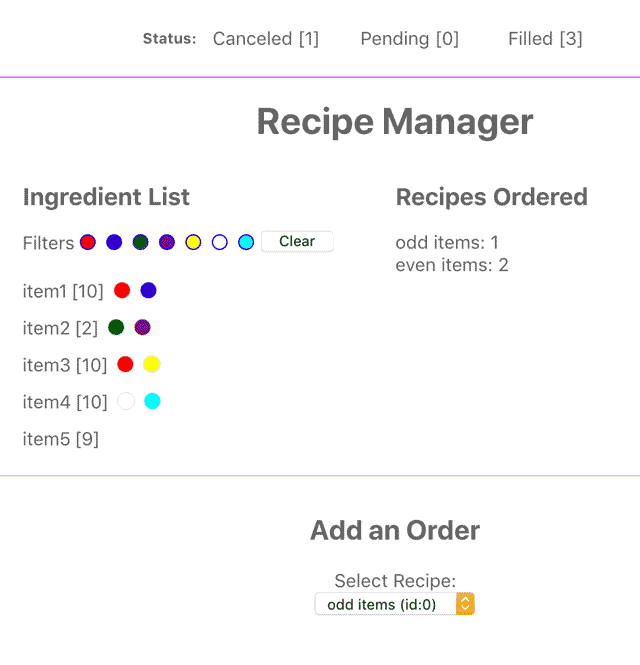

## Recipe Ordering React Hooks Demo
This project was bootstrapped with [Create React App](https://github.com/facebook/create-react-app).

To demonstrate state management of three collections among several components:
ingredients, recipes, and orders. The scenario can be a pizza restaurant.

## Requirements
1. Keep track of ingredients in stock.
2. Keep track of recipes ordered.
3. A newly placed order should have a pending period to allow cancellation.
4. There should be a progress bar noting cancelled, pending and filled orders.
5. If there are insufficient ingredients, a recipe cannot be ordered.
6. The ingredients should have color attributes with a filter to toggle them.

## Available Scripts

In the project directory, you can run:

### `yarn start`

Runs the app in the development mode. 
Open [http://localhost:3000](http://localhost:3000) to view it in the browser.
